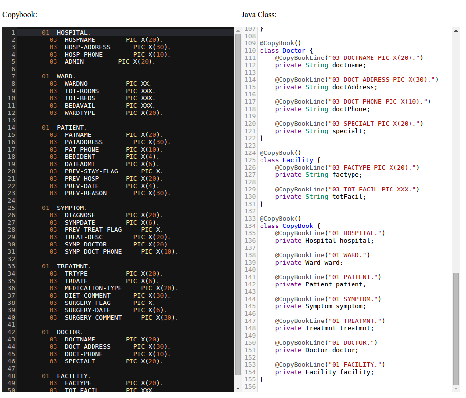

# copybook4java
[](https://travis-ci.org/tlbdk/copybook4java)
[](https://scan.coverity.com/projects/tlbdk-copybook4java)

CopyBook serializer and deserializer for Java where CopyBook lines are used to annotate a normal Java class.

## How to Use It

Annotate request class:

```java
@CopyBook(charset = "cp037")
public class Request {
  @CopyBookLine("02 ID PIC 9(2).")
  private int id;

  @CopyBookLine("02 CMD PIC X(10).")
  private String command;

  @CopyBookLine("01 ARGS OCCURS 10 TIMES.")
  @CopyBookLine("02 ARG PIC X(8).")
  private String[] args;

  public Request(int id, String command, String[] args) {
    this.id = id;
    this.command = command;
    this.args = args;
  }
}
```

Annotate response class:

```java
@CopyBook(charset = "cp037")
public class Response {
  @CopyBookLine("02 ID PIC 9(2).")
  private int id;

  @CopyBookLine("01 LINES OCCURS 80 TIMES.")
  @CopyBookLine("02 LINE PIC X(80).")
  private String[] lines;

  public int getId() {
    return this.id;
  }
  public String[] getLines() {
    return this.lines;
  }
}
```

Construct CopyBookSerializer for Request and Response classes, this will scan the class hierarchy and build a field map that will be used in the serialization and deserialization process:

```java
CopyBookSerializer requestSerializer = new CopyBookSerializer(Request.class);
CopyBookSerializer responseSerializer = new CopyBookSerializer(Response.class);

Request request = new Request(1, "cmd", new String[] { "arg1", "arg2" })
byte[] requestBytes = requestSerializer.serialize(request);

// Call the Backend with whatever client you have for this:
byte[] responseBytes = Backend.submit(requestBytes);

Response response = responseSerializer.deserialize(responseBytes, Response.class);
```

## Supported format annotations and their defaults

CopyBook4Java supports a number of CopyBook formats and can be easily extended to support local variations that does not comply with normal COBOL serialize/deserialize, to do this Implement the CopyBookMapper inteface and reference it from the CopyBook annotation like the build in supported types shown below:

```java
@CopyBook(type = FullMapper.class) // Default format and what you would expect a copybook to look like
@CopyBook(type = FullLastArrayShortMapper.class) // Special version of FullMapper that handles optimizes for a broken format that does not have DEPENDING on for arrays.
@CopyBook(type = PackedFirstLevelMapper.class) // Special non fixed length field format with separator char
```

The different CopyBookMappers can be configured, by using the supported configuration options:

```java
@CopyBook(type = FullMapper.class, charset="UTF-8", strict = true) // Use the FullMapper, UTF-8 as charset and be strict about uninitialized data structures by throwing an exception when this is meet.
```

The CopyBookFieldFormat annotation can be set on both class level on a individual field to overwrite the defaults, the defaults are defined in the interface [CopyBookDefaults](src/main/java/dk/nversion/copybook/annotations/CopyBookDefaults.java)

```java
@CopyBookFieldFormat(type = IntegerToInteger.class, rightPadding = false, paddingChar = '0', nullFillerChar = (byte)0, signingType = CopyBookFieldSigningType.PREFIX)
@CopyBookFieldFormat(type = SignedIntegerToInteger.class, rightPadding = false, paddingChar = '0', nullFillerChar = (byte)0, signingType = CopyBookFieldSigningType.PREFIX)
@CopyBookFieldFormat(type = DecimalToBigDecimal.class, rightPadding = false, paddingChar = '0', nullFillerChar = (byte)0, signingType = CopyBookFieldSigningType.PREFIX)
@CopyBookFieldFormat(type = SignedDecimalToBigDecimal.class, rightPadding = false, paddingChar = '0', nullFillerChar = (byte)0, signingType = CopyBookFieldSigningType.PREFIX)
@CopyBookFieldFormat(type = StringToString.class, rightPadding = true, paddingChar  = ' ', nullFillerChar = (byte)0, signingType = CopyBookFieldSigningType.PREFIX)
```

It's also possible to create new CopyBook annotation to give common settings as custom name:

```java
@CopyBook(type = FullMapper.class, charset = "cp037")
@CopyBookFieldFormat(type = StringToString.class, rightPadding = true, paddingChar  = ' ', nullFillerChar = (byte)0, signingType = CopyBookFieldSigningType.LAST_BYTE_EBCDIC_BIT5)
@Retention(RetentionPolicy.RUNTIME)
@Target(ElementType.TYPE)
public @interface DanishIMS { }
```

Using the new annotation:

```java
@DanishIMS
public class Request {
  @CopyBookLine("02 ID PIC 9(2).")
  private int id;
  ...
}
```
## Using maven plugin to generate code

Include dependencies and plugin in pom.xml, and place copybook definition files in resources folder, fully working sample can be found [here](copybook4java-codegen-maven-test/)

```xml
<dependencies>
    <dependency>
        <groupId>dk.nversion</groupId>
        <artifactId>copybook4java</artifactId>
        <version>1.0.2</version>
    </dependency>
    <dependency>
        <groupId>dk.nversion</groupId>
        <artifactId>copybook4java-codegen-maven-plugin</artifactId>
        <version>1.0.3</version>
    </dependency>
</dependencies>
```

```xml
<build>
    <plugins>
        <plugin>
            <groupId>dk.nversion</groupId>
            <artifactId>copybook4java-codegen-maven-plugin</artifactId>
            <version>1.0.3</version>
            <configuration>
                <inputFilter>^.*\.txt$</inputFilter>
                <inputPath>src/test/resources/</inputPath>
                <language>java</language>
                <packageName>mypackagename</packageName>
            </configuration>
            <executions>
                <execution>
                    <goals>
                        <goal>generate</goal>
                    </goals>
                </execution>
            </executions>
        </plugin>
    </plugins>
</build>
```
## Convert CopyBook to annotated java class

CopyBook4Java provides a simple class converter that can be used for automatic conversion from a copybook to an annotated Java class, just open classconverter.html with any modern browser and copy/paste in the copybook and a translated version will be provided:

[Try it here](https://rawgit.com/tlbdk/copybook4java/master/classconverter.html)


